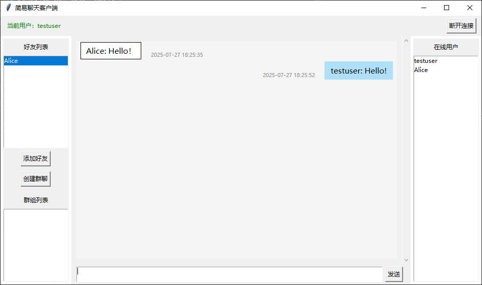

# 简易加密聊天室 / Encrypted Chat Room

[English README](./README_en.md)

## 项目简介

本项目是一个基于 Python 和 Go 的安全加密聊天室，采用现代加密技术（RSA+AES-GCM）实现端到端加密通信。系统支持多用户注册、登录、群聊、私聊、好友管理和群组管理等功能，并使用 SQLite 数据库实现消息持久化存储。所有敏感信息（如密码）都经过安全的 Argon2 算法加密存储，保证用户数据安全。

## 主要特性

- 🔒 **安全性**
  - 端到端加密通信，使用 RSA 进行密钥交换
  - AES-GCM 模式加密所有消息内容
  - Argon2 算法加密存储用户密码
  - 安全的会话密钥管理机制

- 💬 **社交功能**
  - 支持私聊和群聊
  - 好友添加与管理
  - 群组创建与管理
  - 在线状态实时更新

- 💾 **数据管理**
  - SQLite 数据库持久化存储
  - 聊天历史记录查询
  - 用户信息管理
  - 群组信息维护

- 🎨 **用户体验**
  - 简洁直观的图形界面
  - 实时消息提醒
  - 群组成员管理
  - 良好的错误提示

- 🖼️ **界面展示**
  - 登录界面
    
  - 主界面
    
  - 聊天界面
    

- 🛠 **技术依赖**
  - Python 3.x (客户端)
  - Tkinter (GUI界面)
  - pycryptodome (加密功能)
  - argon2-cffi (密码哈希)
  - Go 1.24+ (服务端)
  - SQLite3 (数据存储)
  - 其他内置模块 (socket, threading, datetime, logging等)

## 目录结构

```
chatroom/
├── server.py         # Python服务端代码（支持群聊/密钥交换/群组管理/数据库持久化）
├── client.py         # Python客户端代码（支持群聊/密钥交换/群组管理/GUI）
├── requirements.txt  # Python依赖说明
├── README.md         # 中文说明
├── README_en.md      # English README
├── LICENSE           # GNU GPL v3许可证
├── go-server/        # Go语言实现的服务端
│   ├── cmd/
│   │   └── server/
│   │       └── main.go          # 服务端主程序入口
│   ├── internal/
│   │   ├── crypto/
│   │   │   └── crypto.go        # 加密相关功能
│   │   ├── database/
│   │   │   ├── database.go      # 数据库初始化
│   │   │   ├── user_queries.go  # 用户相关数据库操作
│   │   │   ├── message_queries.go # 消息相关数据库操作
│   │   │   ├── friend_queries.go # 好友相关数据库操作
│   │   │   └── group_queries.go # 群组相关数据库操作
│   │   ├── handlers/
│   │   │   ├── auth_handler.go  # 认证相关处理
│   │   │   └── chat_handler.go  # 聊天相关处理
│   │   ├── models/
│   │   │   ├── user.go          # 用户模型
│   │   │   ├── message.go       # 消息模型
│   │   │   └── group.go         # 群组模型
│   │   ├── protocol/
│   │   │   └── protocol.go      # 通信协议
│   │   ├── server/
│   │   │   ├── server.go        # 服务端核心逻辑
│   │   │   ├── client_manager.go # 客户端管理接口
│   │   │   └── client_manager_impl.go # 客户端管理实现
│   │   └── types/
│   │       └── types.go         # 类型定义
│   ├── go.mod                   # Go模块定义
│   ├── go.sum                   # Go模块校验和
│   ├── README.md                # Go服务端说明文件
│   ├── start.bat                # Windows启动脚本
│   ├── chatroom-server.exe      # 编译后的可执行文件
```

## 数据库说明

数据库文件 (`chat.db`) 会在 Go 服务端首次运行时自动创建。

## 运行说明

### Python服务端

```bash
python server.py
```

服务器首次启动时会自动生成RSA密钥对（private_key.pem 和 public_key.pem）。

### Go服务端

Windows系统可以使用start.bat脚本启动：

```bash
cd go-server
start.bat
```

或者直接运行可执行文件：

```bash
cd go-server
./chatroom-server.exe
```

### 客户端

```bash
python client.py
```

## 数据库结构

系统使用SQLite数据库存储用户、消息、好友和群组信息，包含以下表：

1. `users` 表：存储用户信息
   - id: 用户ID
   - username: 用户名（唯一）
   - password: 密码（Argon2哈希）

2. `messages` 表：存储聊天消息
   - id: 消息ID
   - chat_type: 聊天类型（private/group）
   - from_user: 发送者
   - to_user: 接收者（私聊时使用）
   - gid: 群组ID（群聊时使用）
   - message: 消息内容
   - timestamp: 时间戳

3. `friends` 表：存储好友关系
   - user: 用户
   - friend: 好友

4. `groups` 表：存储群组信息
   - gid: 群组ID
   - group_name: 群组名称
   - owner: 群主
   - members: 群组成员（JSON格式）
   - created_at: 创建时间

## 注意事项

- python服务端默认监听端口 `12345`
- go服务端默认监听端口`12346` 
- 数据库文件会在首次运行时自动创建
- 所有消息都经过AES-GCM加密
- 用户密码使用Argon2哈希算法存储
- 好友关系是双向的
- 群主不能直接退出群聊，需要先解散群聊或转让群主

## 常见问题

- 端口被占用：请检查端口或更换
- 连接失败：请确认服务端已启动，网络正常
- 数据库异常：请确保有写权限，或检查 sqlite3 安装
- 群聊相关问题：请确保群组成员正确，群主不可直接退出群聊

## 新增/改进功能
- 端到端加密：消息采用 AES-GCM 加密，密钥通过 RSA 公钥加密交换
- 密码安全：用户密码采用 Argon2 哈希算法存储
- 群组功能：支持群聊创建、邀请、加入、踢人、群主管理，群组信息持久化
- 群组高级功能：支持群主解散群聊、转让群主、修改群聊名称
- 聊天协议全面升级，所有消息均为结构化 JSON 格式
- 完善的错误处理与日志输出
- 代码结构和注释进一步优化，提升可读性
- 双语支持（中文/英文）
- 双服务端实现（Python/Go）
