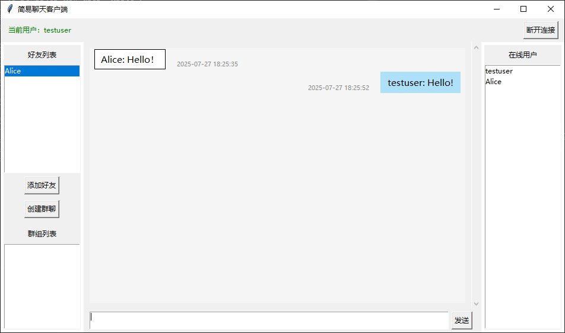

# 🔐 加密聊天室 / Encrypted Chat Room

[English Version](./README_en.md) | [群组功能指南](./GROUP_FEATURES_GUIDE.md) | [Go 服务端文档](./go-server/README.md)


---

## 📖 项目简介

本项目是一个**安全加密的即时通讯聊天室系统**，采用现代密码学技术实现端到端加密通信。系统提供完整的社交功能，包括私聊、群聊、好友管理等，同时确保所有通信内容和用户数据的安全性。

### ✨ 核心优势

- **🔒 端到端加密**：RSA-3072 密钥交换 + AES-GCM 消息加密
- **🛡️ 密码安全**：Argon2id + 随机盐哈希算法存储用户密码
- **🔐 防中间人攻击**：服务端公钥指纹（SHA-256）强制校验
- **💬 丰富功能**：支持私聊、群聊、好友管理、群组管理
- **💾 数据持久化**：SQLite 数据库存储聊天记录和用户信息
- **🚀 双服务端**：Python 和 Go 两种实现，满足不同需求

---

## 🖼️ 界面预览

| 登录界面 | 主界面 | 聊天界面 |
|---------|--------|---------|
|  |  |  |

---

## 🚀 快速开始

### 环境要求

- **Python 客户端 / 服务端**: Python 3.11+
- **Go 服务端**: Go 1.24+（`go.mod` 指定 toolchain `go1.24.5`）
- **操作系统**: Windows / Linux / macOS

### 安装依赖

```bash
pip install -r requirements.txt
```

### 启动服务端

#### 方式一：Python 服务端（端口 12345）

```bash
python server.py
```

> - 首次启动时会自动生成 RSA-3072 密钥对（`private_key.pem` 和 `public_key.pem`）
> - 默认仅监听 `127.0.0.1`（本机回环），如需对外提供服务，请修改 `server.py` 中的 `SERVER_BIND_HOST`

#### 方式二：Go 服务端（端口 12346）

**Windows:**
```bash
cd go-server
start.bat
```

> 也可直接运行预编译的可执行文件 `go-server/chatroom-server.exe`。

**Linux/macOS:**（需先编译）
```bash
cd go-server
go build -o chatroom-server ./cmd/server/main.go
./chatroom-server
```

> Go 服务端默认仅监听 `127.0.0.1:12346`。

### 启动客户端

```bash
python client.py
```

### 客户端连接配置

客户端默认连接本机 Python 服务端（`127.0.0.1:12345`），按需修改 `client.py` 顶部常量：

| 场景 | 修改项 |
|------|--------|
| 连接 Go 服务端 | `SERVER_PORT = 12346` |
| 连接远程服务器 | `SERVER_HOST` 改为目标 IP 或域名 |
| 连接非本机服务器（生产环境） | 设置 `EXPECTED_SERVER_KEY_FINGERPRINT` 为服务器公钥指纹 |

> ⚠️ 连接非本机服务器时**必须**设置 `EXPECTED_SERVER_KEY_FINGERPRINT`，否则客户端会拒绝连接（防止中间人攻击）。
> 首次连接本机服务器后，可从服务端日志中获取实际指纹并填入。

---

## 📋 功能特性

### 🔒 安全特性

| 功能 | 说明 |
|------|------|
| RSA-3072 密钥交换 | 安全的会话密钥协商机制 |
| AES-GCM 加密 | 所有消息内容加密传输 |
| Argon2id 哈希 | 密码哈希 + 随机盐安全存储 |
| 会话密钥管理 | 动态密钥更新机制 |
| 公钥指纹校验 | 防止中间人攻击（MITM） |
| 加密登录 | 登录密码通过 AES-GCM 加密传输 |

### 💬 社交功能

- ✅ **私聊通信**：一对一加密聊天
- ✅ **群聊功能**：支持多人在线群聊
- ✅ **好友管理**：添加、删除好友，查看好友列表
- ✅ **群组管理**：创建群组、邀请成员、踢出成员
- ✅ **高级管理**：解散群组、转让群主、修改群名
- ✅ **在线状态**：实时显示用户在线状态

### 💾 数据管理

- 聊天历史记录持久化存储
- 用户信息和群组信息管理
- 好友关系维护（双向关系）
- SQLite 数据库高效存储

---

## 📁 项目结构

```
chatroom/
├── client.py                          # Python 客户端（GUI/加密/群聊）
├── server.py                          # Python 服务端（数据库/加密/群聊）
├── requirements.txt                   # Python 依赖包
├── go-server/                         # Go 服务端实现
│   ├── README.md                      # Go 服务端文档
│   ├── go.mod / go.sum                # Go 模块定义与校验和
│   ├── chatroom-server.exe            # 预编译 Windows 可执行文件
│   ├── start.bat                      # Windows 启动脚本
│   ├── cmd/server/main.go             # 服务端入口
│   └── internal/
│       ├── crypto/                    # 加密模块
│       ├── database/                  # 数据库操作（含 Argon2 密码哈希）
│       ├── handlers/                  # 请求处理器（认证/聊天）
│       ├── models/                    # 数据模型
│       ├── protocol/                  # 通信协议
│       ├── server/                    # 服务端核心
│       └── types/                     # 类型定义
├── images/                            # 界面截图
├── tests/                             # 测试与漏洞验证脚本
│   ├── test_python_fixes.py           # Python 安全修复单元测试
│   ├── verify_recv_msg_len.py         # 消息长度限制漏洞验证脚本
│   ├── e2e_verify.py                  # 端到端漏洞验证脚本（mock 加密依赖）
│   ├── protocol_test.go               # Go 协议消息长度限制测试
│   └── mocks/                         # 测试用 mock（Crypto / argon2）
├── .github/workflows/                 # GitHub Actions 构建工作流
│   └── build-executables.yml          # 跨平台自动构建
├── README.md                          # 中文文档
├── README_en.md                       # 英文文档
└── GROUP_FEATURES_GUIDE.md            # 群组功能详解
```

---

## 🧪 测试

### Python 测试

```bash
# 安全修复单元测试（客户端指纹 / 好友请求锁）
python tests/test_python_fixes.py

# 消息长度限制漏洞验证脚本（无需外部依赖）
python tests/verify_recv_msg_len.py

# 端到端漏洞验证（使用 tests/mocks 中的 mock 加密依赖，自动启动真实 server.py）
python tests/e2e_verify.py
```

> `tests/mocks/` 提供了 `Crypto` 与 `argon2` 的轻量 mock，使安全验证脚本在未安装
> 加密依赖的环境中也能运行。功能测试请先执行 `pip install -r requirements.txt`。

### Go 测试

```bash
cd go-server
go test ./...          # 运行 Go 服务端全部测试（含 Argon2 密码哈希测试）
```

> `tests/protocol_test.go` 为独立包测试（消息长度限制 / 头部解析 / 并发处理），
> 在 `tests/` 目录下初始化临时 Go module 后即可运行。

---

## 🗄️ 数据库结构

系统使用 SQLite 数据库 (`chat.db`)，首次运行时自动创建。

### 数据表说明

#### 1. users（用户表）

| 字段 | 类型 | 说明 |
|------|------|------|
| id | INTEGER | 用户 ID（主键） |
| username | TEXT | 用户名（唯一） |
| password | TEXT | 密码（Argon2 哈希） |

#### 2. messages（消息表）

| 字段 | 类型 | 说明 |
|------|------|------|
| id | INTEGER | 消息 ID（主键） |
| chat_type | TEXT | 聊天类型（private/group） |
| from_user | TEXT | 发送者 |
| to_user | TEXT | 接收者（私聊） |
| gid | INTEGER | 群组 ID（群聊） |
| message | TEXT | 加密消息内容 |
| timestamp | DATETIME | 时间戳 |

#### 3. friends（好友表）

| 字段 | 类型 | 说明 |
|------|------|------|
| user | TEXT | 用户 |
| friend | TEXT | 好友 |

#### 4. groups（群组表）

| 字段 | 类型 | 说明 |
|------|------|------|
| gid | INTEGER | 群组 ID（主键） |
| group_name | TEXT | 群组名称 |
| owner | TEXT | 群主 |
| members | TEXT | 成员列表（JSON） |
| created_at | DATETIME | 创建时间 |

---

## ⚙️ 配置说明

### 默认端口

| 服务端 | 监听地址 | 端口 |
|--------|----------|------|
| Python 服务端 | 127.0.0.1 | 12345 |
| Go 服务端 | 127.0.0.1 | 12346 |

> 两个服务端默认**仅监听本机回环地址**（`127.0.0.1`），防止外部访问。

### 安全参数

| 参数 | 值 | 说明 |
|------|-----|------|
| RSA 密钥长度 | 3072 位 | 服务端密钥对 |
| 单条消息上限 | 1 MB | 超过上限直接断开连接 |
| 认证阶段超时 | 30 秒 | 未完成认证的连接将被关闭 |
| 会话空闲超时 | 30 分钟 | 登录后空闲连接自动断开 |
| 登录速率限制 | 5 次 / 60 秒 | 防止暴力破解 |
| 用户名长度 | 2 ~ 20 字符 | 服务端强制校验 |
| 密码长度 | 6 ~ 64 字符 | 服务端强制校验 |
| 会话密钥 | AES-GCM 动态生成 | 每次登录重新协商 |

### 重要规则

- 🔐 所有消息均经过 AES-GCM 加密
- 🔑 用户密码使用 Argon2id + 随机盐哈希存储
- 👥 好友关系为双向绑定
- 👑 群主不能直接退出群聊，需先解散或转让
- 💾 数据库文件（`chat.db`）在首次运行时自动创建
- 🗝️ 私钥文件与数据库文件权限默认设为 0600（仅所有者可读写）

---

## 🚀 CI / CD

项目通过 GitHub Actions（`.github/workflows/build-executables.yml`）自动构建跨平台可执行文件：

- **Python 服务端 / 客户端**：Windows（EXE）与 Linux 平台，使用 PyInstaller 打包
- **Go 服务端**：Windows / Linux / macOS 三平台 × amd64 / arm64 交叉编译
- 触发条件：推送到 `main` / `master` / `test` 分支，或 Pull Request
- 构建产物通过 GitHub Actions Artifacts 下载

---

## ❓ 常见问题

### 连接问题

**Q: 端口被占用怎么办？**  
A: 检查是否有其他程序占用端口，或修改服务端端口配置（`server.py` / `main.go` 中的端口常量）。

**Q: 连接失败？**  
A: 确认服务端已启动，检查防火墙设置和网络连接。同时确认客户端端口与服务端一致（Python 服务端 `12345`，Go 服务端 `12346`）。

**Q: 客户端提示"未配置服务器公钥指纹"并拒绝连接？**  
A: 连接非本机服务器时必须设置 `EXPECTED_SERVER_KEY_FINGERPRINT`。先连接本机服务器，从服务端日志中获取
`Server public key fingerprint: xxx` 的实际指纹，再填入 `client.py` 顶部常量。

**Q: 如何连接 Go 服务端？**  
A: 启动 Go 服务端后，将 `client.py` 中的 `SERVER_PORT` 改为 `12346`，重新启动客户端即可。

### 数据库问题

**Q: 数据库异常？**  
A: 确保应用有数据库文件的读写权限，检查 SQLite3 是否正确安装。

### 群聊问题

**Q: 无法退出群聊？**  
A: 群主需要先解散群聊或将群主身份转让给其他成员。

**Q: 群聊消息发送失败？**  
A: 检查群组成员列表是否正确，确认网络连接正常。

---

## 🛡️ 安全加固记录（2026-08）

本版本针对安全审计发现的问题进行了系统性加固：

### 严重漏洞修复

| 漏洞 | 修复 |
|------|------|
| Go 服务端类型断言可导致进程崩溃（远程 DoS） | 全部改为安全类型断言 + `recover` 兜底 |
| Python 服务端无消息长度限制（内存耗尽 DoS） | 单条消息上限 1MB，超限断开 |
| Python 服务端无连接超时（线程耗尽 DoS） | 认证阶段 30 秒超时 + 登录后空闲超时 |
| 登录密码明文传输 | 新增 `encrypted_login` 加密登录协议（AES-GCM） |

### 高危漏洞修复

| 漏洞 | 修复 |
|------|------|
| 非好友可向任意用户发私聊（Go） | 私聊强制好友关系校验 |
| 重复登录无检查（Go） | `IsUserOnline` + `AddClient` 原子拒绝 |
| 好友关系伪造 | 服务端维护待处理请求，`friend_response` 防伪校验 |
| 群组越权加入 | 仅收到邀请的用户可 `group_join` |
| 群组信息泄露 | `group_info` 仅群成员可查看 |

### 中低危漏洞修复

- 密码哈希改用 **Argon2id + 随机盐**（Go 端原用用户名作盐，已兼容旧哈希迁移）
- 客户端连接非本机服务器时强制校验公钥指纹（防止中间人攻击）
- 历史私聊仅对仍是好友的双方可见
- 用户名/密码长度校验（用户名 2-20，密码 6-64）
- 会话状态/速率限制记录定期清理，修复内存泄漏
- 私钥文件权限加固（0600）
- 日志不再记录消息内容
- 客户端畸形消息过滤，防止接收线程崩溃

> ⚠️ **注意**：连接非本机服务器时，请务必在 `client.py` 中设置
> `EXPECTED_SERVER_KEY_FINGERPRINT`（首次连接本机服务器后从日志获取实际指纹）。

---

## 🆕 版本特性

### 最新功能

- ✅ 端到端加密通信（AES-GCM + RSA-3072）
- ✅ 服务端公钥指纹校验（防中间人攻击）
- ✅ Argon2id 密码哈希存储（随机盐）
- ✅ 完整群组功能（创建/邀请/踢人/解散/转让/重命名）
- ✅ 结构化 JSON 通信协议
- ✅ 完善的错误处理和日志系统
- ✅ 安全加固（速率限制、消息长度上限、连接超时）
- ✅ 双语支持（中文/英文）
- ✅ Python 和 Go 双服务端实现
- ✅ GitHub Actions 跨平台自动构建

---

## 📄 许可证

本项目采用 [GNU GPL v3](./LICENSE) 开源许可证。

---

## 🤝 贡献指南

欢迎提交 Issue 和 Pull Request！

---

## 📧 联系方式

如有问题或建议，请通过 Issue 反馈。
