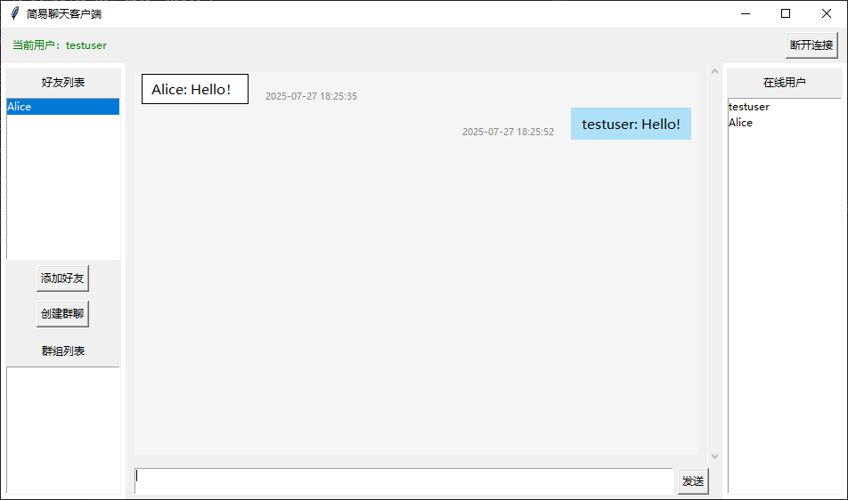

# Encrypted Chat Room

[中文文档](./README.md)

## Project Overview

This project is a secure encrypted chat room system implemented in both Python and Go, featuring end-to-end encryption using modern cryptographic techniques (RSA+AES-GCM). The system supports multiple features including user registration, login, group chat, private chat, friend management, and group management. All messages are persisted in SQLite database, and sensitive information (such as passwords) is securely stored using the Argon2 hashing algorithm.

## Key Features

- 🔒 **Security**
  - End-to-end encrypted communication using RSA for key exchange
  - AES-GCM mode encryption for all messages
  - Argon2 algorithm for password hashing
  - Secure session key management

- 💬 **Social Features**
  - Support for private and group chat
  - Friend request and management
  - Group creation and management
  - Real-time online status updates

- 💾 **Data Management**
  - SQLite database persistence
  - Chat history retrieval
  - User information management
  - Group information maintenance

- 🎨 **User Experience**
  - Clean and intuitive graphical interface
  - Real-time message notifications
  - Group member management
  - User-friendly error handling

- 🖼️ **Interface Showcase**
  - Login Interface
    
  - Main Page
    
  - Chat Interface
    

- 🛠 **Technical Stack**
  - Python 3.x (Client)
  - Tkinter (GUI interface)
  - pycryptodome (Encryption features)
  - argon2-cffi (Password hashing)
  - Go 1.24+ (Server)
  - SQLite3 (Data storage)
  - Built-in modules (socket, threading, datetime, logging, etc.)

## Security Design

- All messages are encrypted with AES-GCM, session key is dynamically generated per login
- Session key is securely exchanged using RSA public key encryption between client and server
- User passwords are stored using Argon2 hash algorithm
- All user, message, friend, and group info are persisted in SQLite database

## Environment Requirements

### Python Client/Server
- Python 3.12 or higher
- Required modules:
  - socket, threading, datetime, sqlite3, hashlib, logging (built-in)
  - struct, json (built-in)
  - pycryptodome (AES, RSA encryption/decryption, install via `pip install pycryptodome`)
  - argon2-cffi (password hashing, install via `pip install argon2-cffi`)
  - Tkinter (GUI, usually built-in, may require separate installation on some systems)

### Go Server
- Go 1.24.5 or higher
- Required modules (automatically managed by Go modules):
  - github.com/google/uuid (for generating group IDs)
  - golang.org/x/crypto (for Argon2 password hashing)
  - modernc.org/sqlite (for SQLite database support)

## Directory Structure

```
chatroom/
├── client.py                    # Python client code (group chat/session key/group management/GUI)
├── GROUP_FEATURES_GUIDE.md      # Group features guide
├── LICENSE                      # GNU GPL v3 License
├── README.md                    # Chinese documentation
├── README_en.md                 # English README
├── requirements.txt             # Python dependency list
├── server.py                    # Python server code (group chat/session key/group management/database persistence)
├── go-server/                   # Go language implementation of the server
│   ├── chatroom-server.exe      # Compiled executable file
│   ├── go.mod                   # Go module definition
│   ├── go.sum                   # Go module checksums
│   ├── README.md                # Go server documentation
│   ├── start.bat                # Windows startup script
│   ├── cmd/
│   │   └── server/
│   │       └── main.go          # Server main program entry point
│   ├── internal/
│   │   ├── crypto/
│   │   │   └── crypto.go        # Encryption related functions
│   │   ├── database/
│   │   │   ├── database.go      # Database initialization
│   │   │   ├── friend_queries.go # Friend-related database operations
│   │   │   ├── group_queries.go # Group-related database operations
│   │   │   ├── message_queries.go # Message-related database operations
│   │   │   └── user_queries.go  # User-related database operations
│   │   ├── handlers/
│   │   │   ├── auth_handler.go  # Authentication related processing
│   │   │   └── chat_handler.go  # Chat related processing
│   │   ├── models/
│   │   │   ├── group.go         # Group model
│   │   │   ├── message.go       # Message model
│   │   │   └── user.go          # User model
│   │   ├── protocol/
│   │   │   └── protocol.go      # Communication protocol
│   │   ├── server/
│   │   │   ├── client_manager_impl.go # Client management implementation
│   │   │   └── server.go        # Server core logic
│   │   └── types/
│   │       └── types.go         # Type definitions
├── images/                      # Interface screenshots
│   ├── chat.PNG                 # Chat interface
│   ├── login in.PNG             # Login interface
│   └── main page.png            # Main page
```

## Database Information

The database file (`chat.db`) will be automatically created when the Go server is run for the first time.

## Database Structure

The system uses an SQLite database to store user, message, friend, and group information, including the following tables:

1. `users` table: Stores user information
   - id: User ID
   - username: Username (unique)
   - password: Password (Argon2 hash)

2. `messages` table: Stores chat messages
   - id: Message ID
   - chat_type: Chat type (private/group)
   - from_user: Sender
   - to_user: Receiver (used for private chat)
   - gid: Group ID (used for group chat)
   - message: Message content
   - timestamp: Timestamp

3. `friends` table: Stores friend relationships
   - user: User
   - friend: Friend

4. `groups` table: Stores group information
   - gid: Group ID
   - group_name: Group name
   - owner: Group owner
   - members: Group members (JSON format)
   - created_at: Creation time

## Running Instructions

### Python Server

```bash
python server.py
```

The server will automatically generate RSA key pair (private_key.pem and public_key.pem) on first startup.

### Go Server

On Windows systems, you can use the start.bat script to start:

```bash
cd go-server
start.bat
```

Or run the executable directly:

```bash
cd go-server
./chatroom-server.exe
```

### Client

```bash
python client.py
```

## Notes

- The python server default port is `12345`
- The go server default port is `12346`
- The database file will be automatically created on first run
- All messages are AES-GCM encrypted for security
- Session key is exchanged via RSA public key encryption
- User passwords are stored using Argon2 hash algorithm
- Friend relationships are bidirectional
- Group owners cannot directly leave the group chat and must disband the group or transfer ownership first
- Log information is output to the terminal for debugging

## Common Issues

- Port occupied: Check if the port is in use or change it
- Connection failure: Ensure the server is running and the network is operational
- Database errors: Verify write permissions or check sqlite3 installation
- Group chat issues: Ensure group members are correct, owner cannot leave group directly

## Highlights
- End-to-end encryption: AES-GCM for messages, session key exchanged via RSA public key
- Password security: Argon2 hash for user passwords
- Group features: group creation, invitation, join, kick, owner management, persistent group info
- Advanced group features: group disbanding, ownership transfer, group name modification
- All messages use structured JSON protocol
- Robust error handling and logging
- Further optimized code structure and comments for better readability
- Bilingual support (Chinese/English)
- Dual server implementation (Python/Go)
